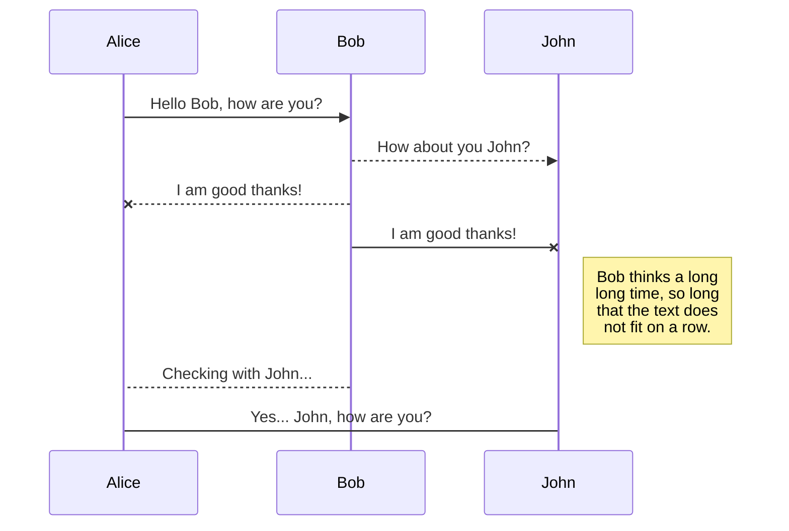
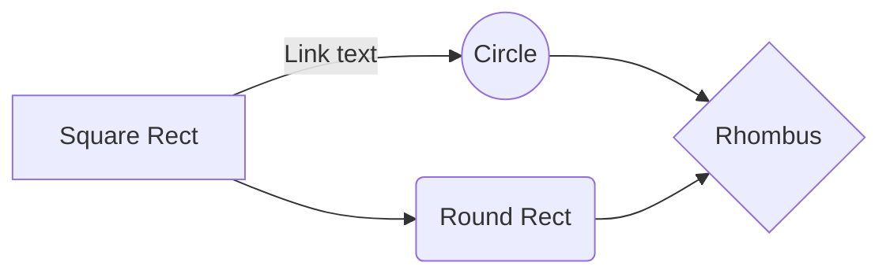

IMAGEN ORT
---
# Universidad ORT Uruguay | Facultad de ingeniería | Escuela de tecnología - DevOps | Obligatorio

## Documento Readme Obligatorio

### Mauro Veloso 276756

# Indice

1
2
3
4
5

# Presentacion del problema

Lorem ipsum

# Solucion Planteada

Lorem ipsum

## Herramientas y Proveedores

Como herramientas a utlizar se seleccionaron las siguientes:

 - **Herramienta de Git**: GitHub
 - **Herramienta de CI/CD**: GitHub Actions
 - **Orquestador**: AWS ECS
 - **Proveedor de Cloud**: AWS
 - **Herramienta de Testing de Código Estático**: SonarCloud
 - **Herramienta de Prueba extra**:
 - **Aplicación FE a buildear y desplegar**: Vue
 - **Servicio Serverless**:

## Tablero Kanban

Lorem ipsum

## Repositorios

Se decide diseñar una estructura de 2 repositorios. Un repositorio para almacenar los microservicios y uno para todo lo orientado a DevOps.

### Repositorio DevOps

Para el manejo del repositorio de DevOps se va a utilizar un flujo Trunk based. Se toma la decisión con la consideración de que se apunta a manejar Feature branches de corta vida con pequeñas modificaciónes y no se apunta a mantener otras branches con copias del código, permitiendo evitar problemas al realizar el merge. Manteniendo un ecosistema limpio y pronto para buildear en el momento oportuno.

#### Diagrama de flujo

### Repositorio MicroServicios

Para el repositorio donde se hospedarán los MicroServicios se decide por el uso del flujo GitFlow

#### Diagrama de flujo

## SmartyPants

SmartyPants converts ASCII punctuation characters into "smart" typographic punctuation HTML entities. For example:

|                |ASCII                          |HTML                         |
|----------------|-------------------------------|-----------------------------|
|Single backticks|`'Isn't this fun?'`            |'Isn't this fun?'            |
|Quotes          |`"Isn't this fun?"`            |"Isn't this fun?"            |
|Dashes          |`-- is en-dash, --- is em-dash`|-- is en-dash, --- is em-dash|

## KaTeX

You can render LaTeX mathematical expressions using [KaTeX](https://khan.github.io/KaTeX/):

The *Gamma function* satisfying $\Gamma(n) = (n-1)!\quad\forall n\in\mathbb N$ is via the Euler integral

$$
\Gamma(z) = \int_0^\infty t^{z-1}e^{-t}dt\,.
$$

> You can find more information about **LaTeX** mathematical expressions [here](http://meta.math.stackexchange.com/questions/5020/mathjax-basic-tutorial-and-quick-reference).

## UML diagrams

You can render UML diagrams using [Mermaid](https://mermaidjs.github.io/). For example, this will produce a sequence diagram:

And this will produce a flow chart:

