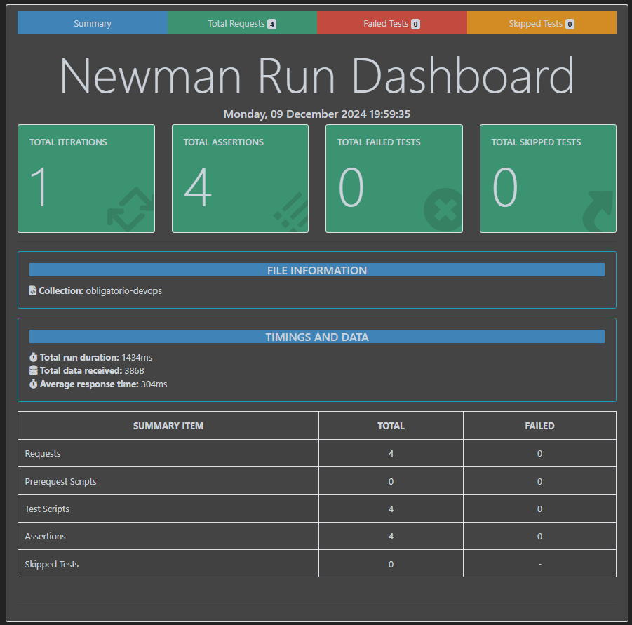
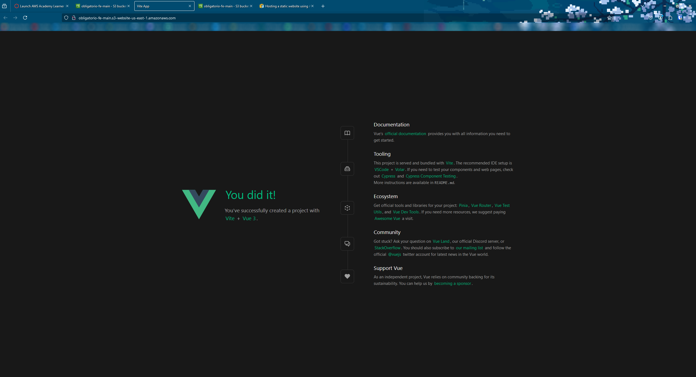

<p align = "center">

</p>

---

# Universidad ORT Uruguay | Facultad de ingeniería | Escuela de tecnología - DevOps | Obligatorio

## Documento Readme Obligatorio

### Mauro Veloso 276756

# Indice

```
.
├── Presentacion del problema
├── Solucion Planteada
├──── Herramientas y Proveedores
│
├──── Tablero Kanban
│   ├── Presentación visual - Uso del Kanban
│
├──── Repositorios
│   ├── Repositorio DevOps
│       ├── Presentación visual - Diagrama de flujo
│   ├── Repositorios de MicroServicios y Frontend
│       ├── Presentación visual - Diagrama de flujo
│
├──── Estructura AWS
│   ├── VPC
│   ├── ECR
│   ├── ECS
│   ├── Task Definitions
│   ├── Services
│   ├── S3 Buckets
│
├──── CI/CD
│   ├── Análisis de código estático
│       ├── Presentación visual
│   ├── Análisis de microservicios
│       ├── Presentación visual - Diagrama de flujo
│       ├── Presentación visual - Reporte
│   ├── Build
│       ├── MicroSevices
│       ├── FrontEnd
│   ├── Deploy
│       ├── MicroSevices
│       ├── FrontEnd
│   ├── Presentación visual - CICD Corriendo FE
│   ├── Presentación visual - CICD Corriendo BE
│
└──── IaC - Terraform
```


# Estructura

# Presentacion del problema

El problema presentado es el de una empresa líder en retail, cual se manifiesta durante el lanzamiento de una nueva aplicación revolucionaria a la experiencia de compra de los clientes.
Esto involucra a tanto el equipo de desarrollo, como al de infraesctrucutra. Provocando inesperados errores y caidas del sistema.
El problema resulta por la separacion y falta de comunicación efectiva entre ambos equipos. Se genera una lucha constante entre la busqueda de estabilidad y disponibilidad del sistema con la busqueda de rapidez y continua entrega de nuevas funcionalidades.
Esto requiere un cambio cultural y organizativo, enfocado en la colaboracion y entendimiento mutuo, en la responsabilidad compartiva del producto final. Unido a esto también, el uso de herramientas y practicas nuevas que ayudasen a ese entendimiento.

# Solucion Planteada

Como solución se presenta un flujo de trabajo automatizando, estructurando y comunicando eficientemente todas las uniones entre el trabajo de los desarrolladores (Dev) y el equipo de infraestructura (Ops).
Esto apunta a mejorar los siguientes aspectos del organigrama de trabajo actual:

* Rápida deteccion de incidentes graves, impidiendo despliegues erroneos
* Flujos de desarrollo con feedback continuo (GitFlow)
* Automatización de flujos repetitivos tanto de Dev como de Ops
* Mejoras en el TTM de la empresa

A continuación se detalla la solución presentada en detalle.

## Herramientas y Proveedores

Como herramientas a utlizar se seleccionaron las siguientes:

**Herramienta de Git**: GitHub

**Herramienta de CI/CD**: GitHub Actions

**Orquestador**: AWS ECS

**Proveedor de Cloud**: AWS

**Herramienta de Testing de Código Estático**: SonarCloud

**Herramienta de Prueba extra**: Postman

**Aplicación FE a buildear y desplegar**: Vue

**Servicio Serverless**: S3 Bucket

## Tablero Kanban

Se maneja un tablero kanban para documentar el trayecto continuo del proyecto.

### Presentación visual - Uso del Kanban

<p align = "center">

</p>

<p align = "center">

</p>

## Repositorios

Se decide diseñar una estructura de 6 repositorios. Cuatro repositorios para almacenar los microservicios, uno para el FrontEnd y uno para todo lo orientado a DevOps.

### Repositorio DevOps

Para el manejo del repositorio de DevOps se va a utilizar un flujo Trunk based. Se toma la decisión con la consideración de que se apunta a manejar Feature branches de corta vida con pequeñas modificaciónes y no se apunta a mantener otras branches con copias del código, permitiendo evitar problemas al realizar el merge. Manteniendo un ecosistema limpio y pronto para buildear en el momento oportuno.

#### Presentación visual - Diagrama de flujo

<p align = "center">

</p>

### Repositorios de MicroServicios y Frontend

Para los repositorios donde se hospedarán los MicroServicios y el repositorio del FrontEnd se decide por el uso del flujo GitFlow. Permitiendo mantener una rama estable para cada ambiente manejado (prod/main, dev, test), con su respectiva lógica de CI/CD.
En este caso se decide utilizar tres ramas estables. Main, que actua como la rama donde se almacena el código desplegable en producción. Dev, donde se almacena el código desplegable en el ambiente de desarrollo. Y por último, Test, donde se almacena el código desplegable en el ambiente de testing.

#### Presentación visual - Diagrama de flujo

<p align = "center">

</p>

## Estructura AWS

### VPC

Se hacen uso de dos VPCs, una para el ambiente de producción (main) el cual se apunta a dejar aislado de los otros ambientes de pruebas y el VPC default de AWS el cual incluye tanto el ambiente de test como el de dev.

<p align = "center">

</p>

### ECR

La solución propuesta hace de un repositorio ECR por cada microservicio. En ellos se almacenan con el tag acorde al ambiente las últimas versiónes del empaquetado de los mismos.

El formato es el de `devops/<NOMBRE_MS>:<AMBIENTE>`

<p align = "center">

</p>

### ECS

La solución propuesta para el orquestador hace uso de 3 Clusters para aplicaciones con FARGATE, uno para cada ambiente.

El formato es el de `<AMBIENTE>-cluster`

<p align = "center">

</p>

#### Task Definitions

Se generan 3 task definitions, cada una agarrando una imágen con el tag (ambiente) correspondiente y su microservicio. 

El formato es el de `<NOMBRE_MS>-<AMBIENTE>`

<p align = "center">

</p>

#### Services

Los services son creados al momento del despliegue.
Entiendo que haciendo uso de terraform cloud uno es capaz de automatizar este proceso, pero no fui capaz de implementarlo en el tiempo que tenia.

El formato es el de `<NOMBRE_MS>-sv-<AMBIENTE>`

### S3 Buckets

Se hace uso de 3 buckets, uno para cada ambiente

<p align = "center">

</p>

## CI/CD

Para el CI/CD trabajamos con 2 workflows principales encontrados en el repositorio de DevOps, cuales son llamados por los demás repositorios. Esto asegura coherencia y reduccion de sobre trabajo cuando se necesita hacer un cambio al flujo. 
Dentro de los demás repositorios (Microservicios y FE) solo existe un workflow que llama al flujo reutilizable acorde.

Esto solo será llamado cuando se realizan Pull Requests a las ramas estables de cada repositorio. Evitando correr el flujo en momentos y con code bases inadecuadas.

```
name: Call CICD Workflow

on:
  pull_request:
    branches:
      - main
      - dev
      - test

permissions: 
  id-token: write # required!
  contents: read

jobs:
  call_cicd_workflow:
    name: Llamar al workflow reutilizable de CICD
    uses: DevOps-Obligatorio-MV276756/Obligatorio-DevOps/.github/workflows/cicd_workflow.yml@main
    secrets: inherit
```

Y este workflow acorde es el que se encarga de hacer tanto el testing, buildeo, testing extra y despliegue de la aplicación.
Las etapas de estos flujos son las mencionadas a continuación.

### Análisis de código estático

Para el análisis de código estático se decide hacer uso de SonarCloud.
El testing con SonarCloud se encuentra como primer paso en el flujo de CI/CD tanto para los microservicios como para el FE.
Se trabaja con la Quality Gate base de SonarCloud para brindar el análisis.

#### Presentación visual

Para el FE se maneja directo desde los PR con el automatic analysis de SonarCloud
<p align = "center">

</p>

Para el BE lo maneja el mismo workflow
<p align = "center">

</p>

### Análisis de microservicios

Para el análisis de los microservicios de hace uso de una collections de Postman y Newman.
Esto recorre cada aplicación y asegura su correcto funcionamiento. Luego de las pruebas se genera un reporte de lo analizado que es presentado en un canal de slack para control y auditoria, permitiendo una referencia almacenada para el acceso de cualquier interesado.
Esto se realiza de manera automatica haciendo uso de una libreria de reporteria y un app en Slack que recibe el archivo y lo publica.

#### Presentación visual - Diagrama de flujo

<p align = "center">

</p>

#### Presentación visual - Reporte

<p align = "center">

</p>

<p align = "center">

</p>

### Build

#### MicroSevices

Para los microservicios se realiza el flujo de buildeo en 2 etapas. La primera empaqueta la aplicación en un archivo JAR y la sube como artifact. Y la segunda descarga ese artifact y lo pushea al repositorio AWS ECR del microservicio particular, con el nombre de la rama como tag, simbolizando el ambiente a poblar a momento de desplegar.

#### FrontEnd

Para el FE, el buildeo es más simple, descargamos las dependencias de la aplicación y construimos la solución. La cual se almacena en la carpeta `./dist`

### Deploy

#### MicroSevices

Para el despliegue de los MS se descarga primero el task definition acorde al repositorio y ambiente para luego desplegar un service con esa definición haciendo uso del action `aws-actions/amazon-ecs-deploy-task-definition`

#### FrontEnd

Por el lado del FE se decidio en un principio hacer uso del action `lewandy/vue-s3-deployer`, cual afirmaba hacer todos los pasos requeridos de una manera eficiente y organizada. Lamentablemente, luego de investigación al no funcionar al correr el workflow, ese action resultó no funcional desde finales de Septiembre sin aparente interes en darle solución.
Es por ello que se decidió hacer el despliegue de la siguiente manera:

```
      - name: Upload dist to S3 bucket
        run: aws s3 sync ./dist/ ${{ env.CALLEE_NAME }}-${{ env.CALLEE_BRANCH2 }}
```

Se comprueba que funciona el deploy

<p align = "center">

</p>

<p align = "center">

</p>

### Presentación visual - CICD Corriendo FE

<p align = "center">

</p>

### Presentación visual - CICD Corriendo BE

<p align = "center">

</p>

## IaC - Terraform

Para el IaC se habia decidido utilizar Terraform. Luego de varios intentos, esto no resultó posible. Se decidió para continuar en tiempo y forma hacer la infraestructura de forma manual. Esto no significa que no se utilizará terraform solo que no se diseña de primera mano haciendo uso de la herramienta. Se hizo uso de Terraformer (https://ashutoshjecrchai.medium.com/terraformer-generate-terraform-files-from-existing-aws-infrastructure-25792886eda5) para generar código terraform basado en la estrucutra de aws existente. Permitiendo tener IaC de la solución propuesta para futuras iteraciones.
